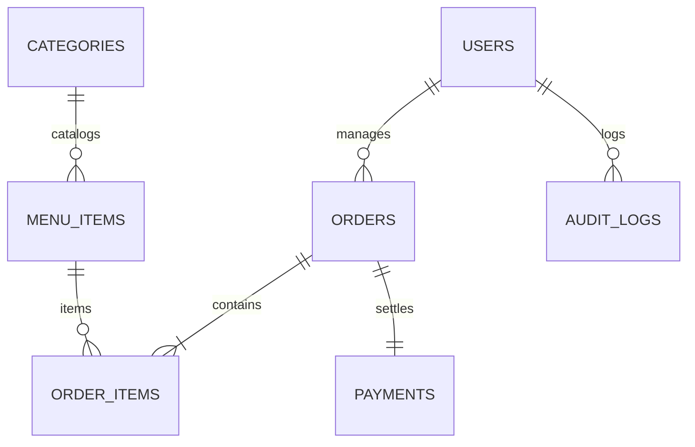

# Database ER Diagram

```mermaid
erDiagram
    USERS ||--o{ ORDERS : manages
    CATEGORIES ||--o{ MENU_ITEMS : catalogs
    ORDERS ||--|{ ORDER_ITEMS : contains
    MENU_ITEMS ||--o{ ORDER_ITEMS : items
    ORDERS ||--|| PAYMENTS : settles
    USERS ||--o{ AUDIT_LOGS : logs
```
