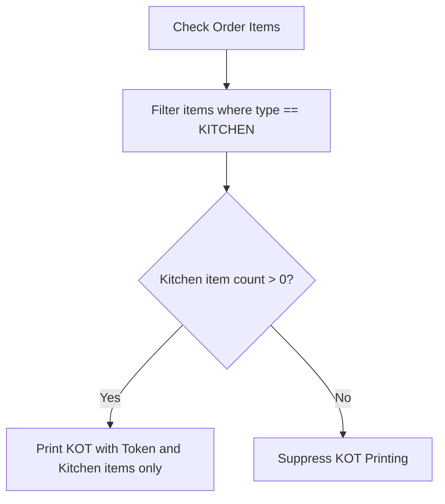

# Kitchen Order Ticket (KOT) Workflow

- Filter KOT items:

```mermaid
graph TD
  CheckOrder[Check Order Items] --> FilterKitchen[Filter items where type == KITCHEN]
  FilterKitchen --> CountCheck{Kitchen item count > 0?}
  CountCheck -- Yes --> GenerateKOT[Print KOT with Token and Kitchen items only]
  CountCheck -- No --> SuppressKOT[Suppress KOT Printing]
```
