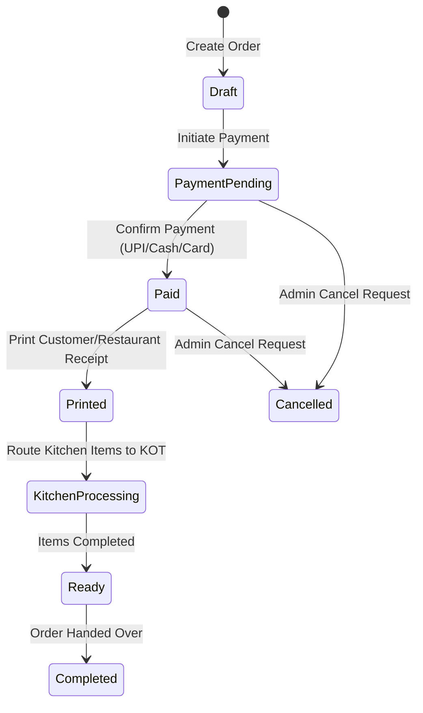

# Order Workflow Diagram

```mermaid
stateDiagram-v2
    [*] --> Draft : Create Order
    Draft --> PaymentPending : Initiate Payment
    PaymentPending --> Paid : Confirm Payment (UPI/Cash/Card)
    Paid --> Printed : Print Customer/Restaurant Receipt
    Printed --> KitchenProcessing : Route Kitchen Items to KOT
    KitchenProcessing --> Ready : Items Completed
    Ready --> Completed : Order Handed Over
    Paid --> Cancelled : Admin Cancel Request
    PaymentPending --> Cancelled : Admin Cancel Request
```
