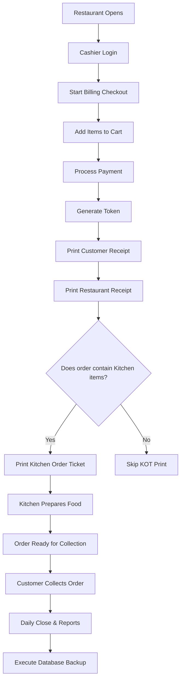

# POS Workflow

```mermaid
graph TD
  Start[Restaurant Opens] --> Login[Cashier Login]
  Login --> POS[Start Billing Checkout]
  POS --> Select[Add Items to Cart]
  Select --> Pay[Process Payment]
  Pay --> Token[Generate Token]
  Token --> PrintCust[Print Customer Receipt]
  PrintCust --> PrintRest[Print Restaurant Receipt]
  PrintRest --> CheckKOT{Does order contain Kitchen items?}
  CheckKOT -- Yes --> KOT[Print Kitchen Order Ticket]
  CheckKOT -- No --> Skip[Skip KOT Print]
  KOT --> Prep[Kitchen Prepares Food]
  Prep --> Ready[Order Ready for Collection]
  Ready --> Handover[Customer Collects Order]
  Handover --> Close[Daily Close & Reports]
  Close --> Backup[Execute Database Backup]
```
