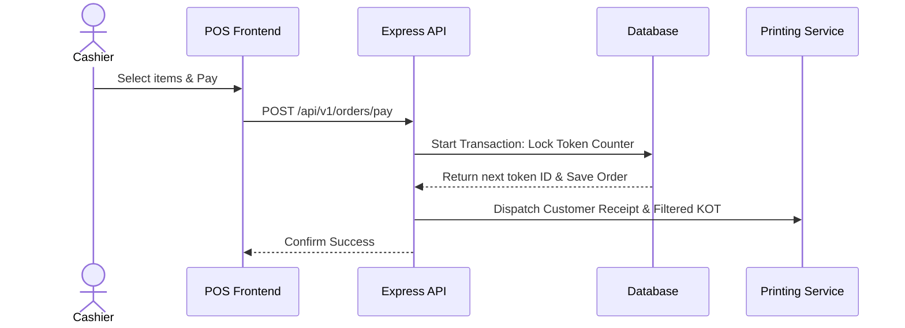

# Sequence Diagrams

## Checkout Flow

```mermaid
sequenceDiagram
    actor Cashier
    participant Client as POS Frontend
    participant Server as Express API
    participant DB as Database
    participant Printer as Printing Service

    Cashier->>Client: Select items & Pay
    Client->>Server: POST /api/v1/orders/pay
    Server->>DB: Start Transaction: Lock Token Counter
    DB-->>Server: Return next token ID & Save Order
    Server->>Printer: Dispatch Customer Receipt & Filtered KOT
    Server-->>Client: Confirm Success
```
