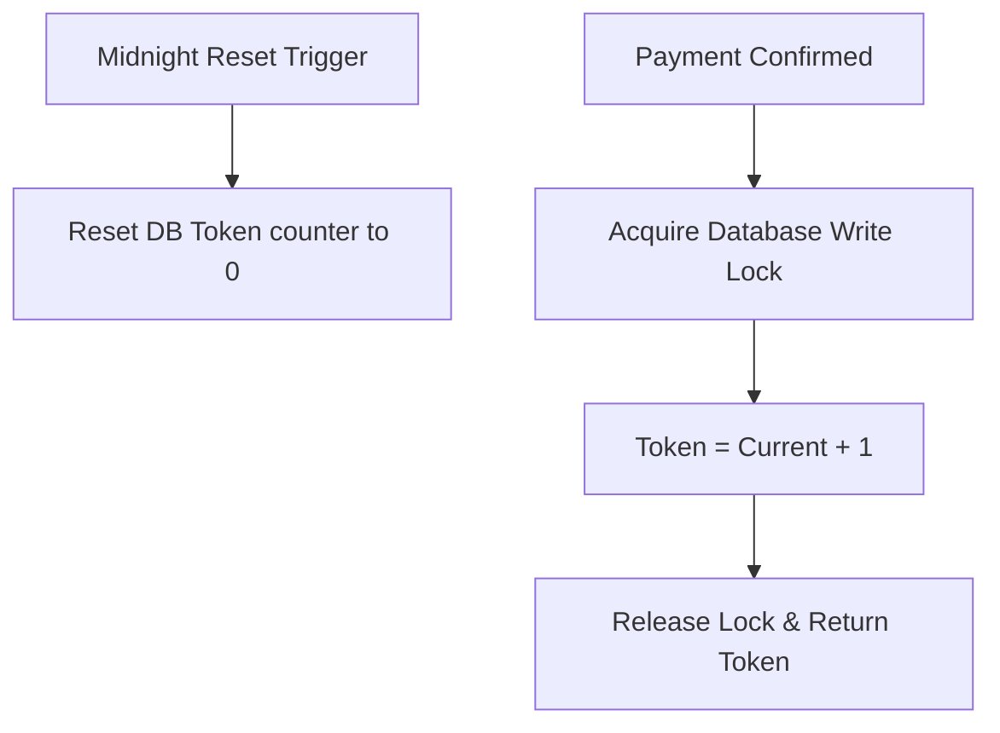

# Token Generation Workflow

- Token increment is executed inside a serialized transaction.
- Daily resetting sequence:

```mermaid
graph TD
  NewDay[Midnight Reset Trigger] --> ResetCounter[Reset DB Token counter to 0]
  OrderPaid[Payment Confirmed] --> LockCounter[Acquire Database Write Lock]
  LockCounter --> Increment[Token = Current + 1]
  Increment --> ReleaseLock[Release Lock & Return Token]
```
